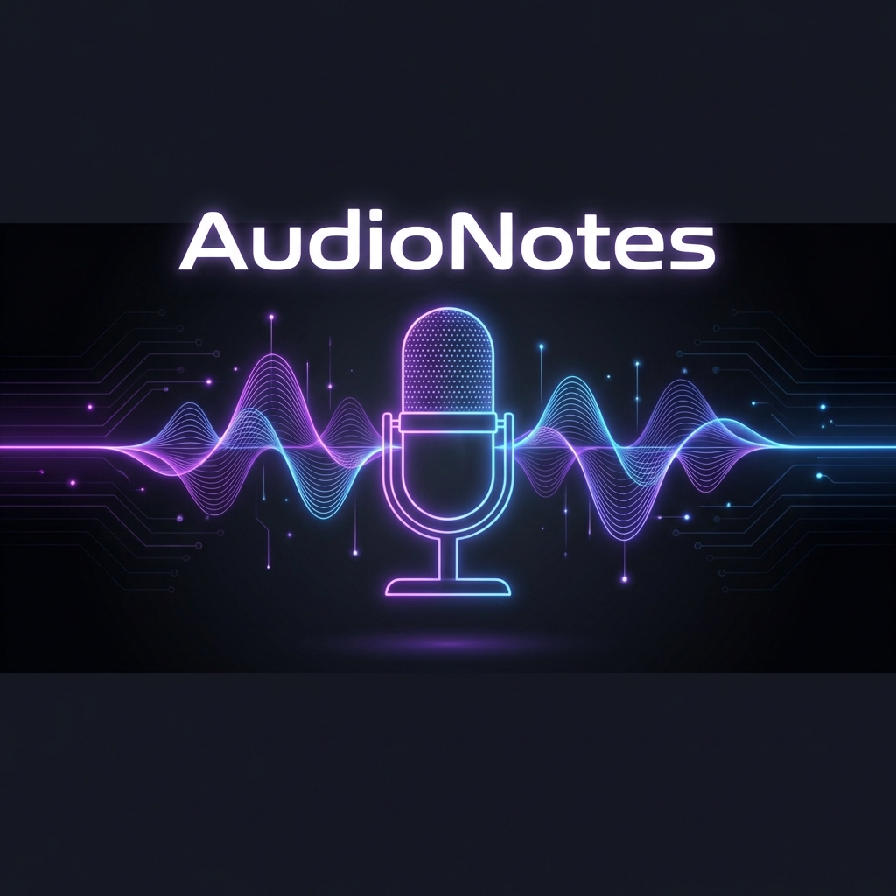
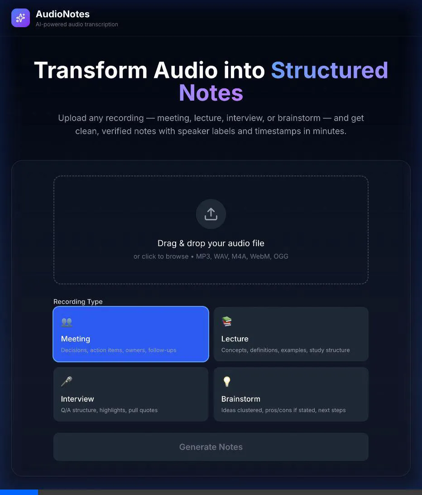
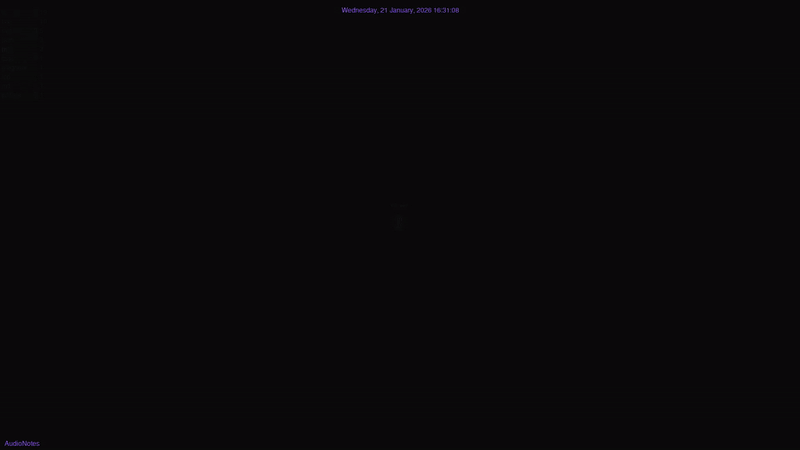
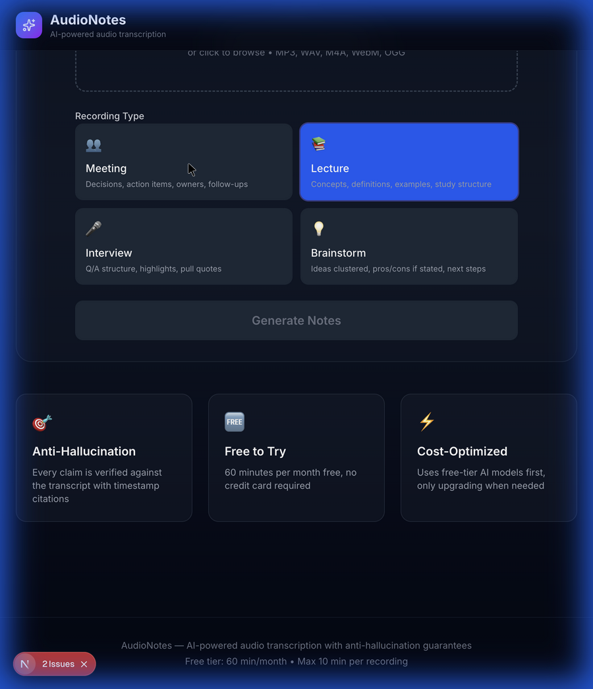
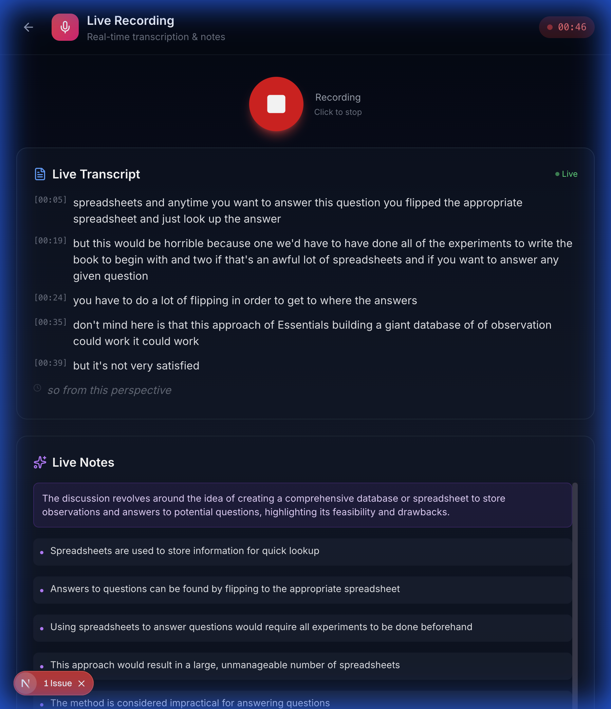

<div align="center">
  

  # AudioNotes 🎙️
  
  **Transform messy audio into trustworthy, structured notes with the power of Local AI.**

  [](https://nextjs.org/)
  [](https://www.typescriptlang.org/)
  [](https://tailwindcss.com/)
  [](https://www.prisma.io/)
  [](https://groq.com/)
</div>

<br />

> "I built AudioNotes because I wanted a reliable way to turn messy audio recordings—meetings, lectures, and brain dumps—into structured, trustworthy notes I could actually use. Unlike generic transcription tools that just dump a wall of text, this system is verifying, cost-effective, and halluncination-resistant." — *Haadesx*

<br />

## 🎥 See it in Action

<div align="center">
  
</div>

<br />

## 📜 How it was Made (Project History)

A **Gource** visualization of the entire development process. Watch the codebase grow from a simple idea to a full application.

<div align="center">
  
</div>

<br />

## ✨ Two Powerful Modes

<table width="100%">
<tr>
<td width="50%" align="center">
<h3>🔴 file Upload Mode</h3>
<p>Drag & drop pre-recorded files. Uses high-accuracy async transcription.</p>

</td>
<td width="50%" align="center">
<h3>🎙️ Live Recording Mode</h3>
<p>Real-time transcription & notes as you speak. Perfect for meetings.</p>

</td>
</tr>
</table>

<br />

## 🚀 Key Features

*   **🛡️ Anti-Hallucination Engine**: Every claim in the notes is verified against the transcript. If the AI can't find a timestamped source for a claim, it's rejected.
*   **💸 Smart Cost Routing**: Uses a "waterfall" strategy. Always attempts to use free, high-speed models (Llama 3 on Groq) first. Only falls back to paid providers when absolutely necessary.
*   **🔒 Local-First Privacy**: Your recordings and database (`SQLite`) live on your machine. We don't train on your data.
*   **📝 Adaptive Formats**: Smart templates for different needs:
    *   *Meeting*: Decisions, Action Items, Owners
    *   *Lecture*: Key Concepts, Definitions, Examples
    *   *Interview*: Q&A format, key quotes
    *   *Brainstorm*: Unstructured idea mapping

<br />

## 🛠️ Tech Stack

This project is built with a modern, robust stack designed for performance and developer experience.

<details>
<summary><b>Click to see detailed stack</b></summary>

| Category | Technology | Reason |
|----------|------------|--------|
| **Framework** | Next.js 14 (App Router) | Best-in-class React framework with server components. |
| **Styling** | Tailwind CSS | Rapid UI development with modern aesthetics. |
| **Database** | SQLite + Prisma | Zero-config, type-safe database for local persistence. |
| **AI (Inference)** | Groq | Insanely fast Llama 3 inference (800+ tokens/s). |
| **AI (Fallback)** | OpenRouter | Access to DeepSeek R1, Gemini 2.0, and more. |
| **Transcription** | Web Speech API / AssemblyAI | Hybrid approach for real-time and high-accuracy async. |
| **State** | React Hooks | Custom hooks (`useLiveTranscription`) for complex media handling. |

</details>

<br />

## 🏃‍♂️ Getting Started

Want to run this locally? It's easy.

1.  **Clone the repo**
    ```bash
    git clone https://github.com/Haadesx/NewNotes.git
    cd NewNotes
    ```

2.  **Install Dependencies**
    ```bash
    npm install
    ```

3.  **Configure Environment**
    Create a `.env` file in the root directory:
    ```env
    DATABASE_URL="file:./prisma/dev.db"
    GROQ_API_KEY="your_key_here"
    # Optional:
    OPENROUTER_API_KEY="your_key_here"
    ASSEMBLYAI_API_KEY="your_key_here"
    ```

4.  **Run the Server**
    ```bash
    # Initialize database
    npx prisma db push

    # Start app
    npm run dev
    ```

5.  **Enjoy!**
    Open `http://localhost:3000` to start recording.

<br />

## 🔮 Future Roadmap

- [ ] **Cloud Sync**: Optional sync to Google Drive / S3.
- [ ] **Speaker ID**: Identify who said what in live mode.
- [ ] **Obsidian Export**: One-click export to your second brain.
- [ ] **Mobile App**: PWA support for mobile recording.

---

<div align="center">
  <sub>Built with ❤️ by Haadesx</sub>
</div>
